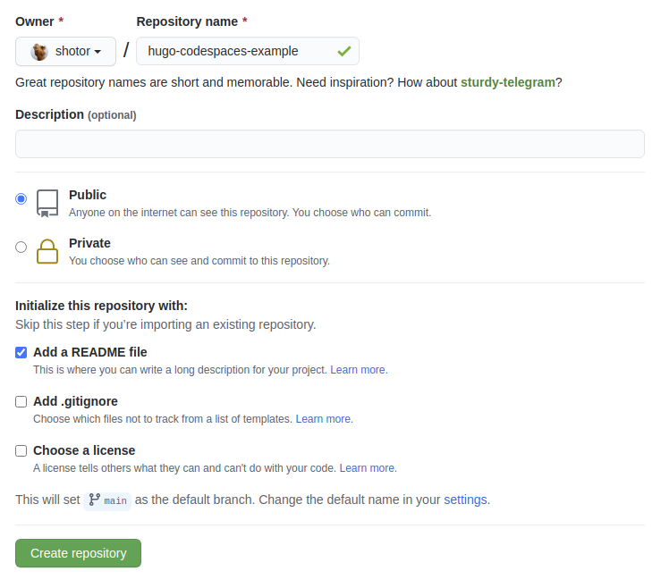
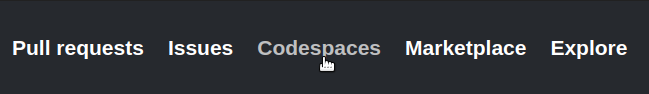
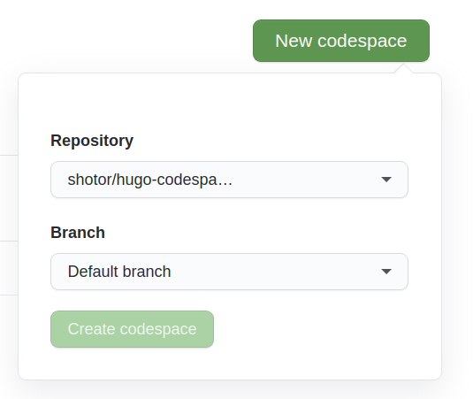
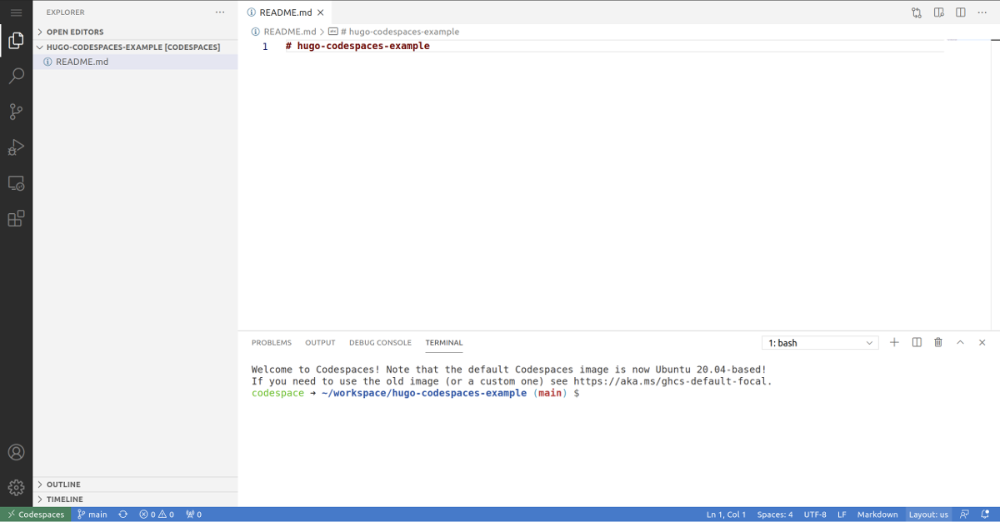
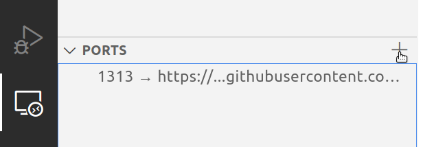

+++
title = "Build a Hugo static site in your browser using GitHub Codespaces"
description = "A guide on how to build a Hugo static site in your browser using GitHub Codespaces"
date = 2021-01-24
updated = 2021-01-25
+++

I recently built a static website for a friend using [Hugo](https://gohugo.io/). We installed everything he needed to add content to his website on his laptop. And by all I mean just Hugo and Visual Studio Code. Then he reset his laptop and that set me thinking if we can do with even less, preferably installing nothing at all on his computer.

[GitHub Codespaces](https://github.com/features/codespaces) came to mind. With GitHub Codespaces (currently in early access) we get a full VSCode powered development environment in the browser. Best of all it runs in an Ubuntu container giving terminal access, includes tools like Hugo out of the box and handles port forwarding for us.

There's something to be aware of with the automatic port forwarding and static assets such as images. So in this post I'll show how you can build and debug a static site built with [Hugo](https://gohugo.io/) in GitHub Codespaces.

## Getting started

We'll first create an empty repository in GitHub. Make sure to add an empty README file, so we can easily open it with codespaces later on.



Open GitHub Codespaces in the navigation bar.



Then create a new Codespace by selecting our repository.



After a minute your VSCode environment should be ready to go.



## Hugo

Let's start with [Hugo](https://gohugo.io/). We'll run the commands of the [Hugo quick start](https://gohugo.io/getting-started/quick-start/) with one modification. If you prefer to just look at the code, check out the [repository](https://github.com/shotor/hugo-codespaces-example).

```sh
# create a new site in the root folder, force it because it's not empty
hugo new site . --force

# add ananke theme
git submodule add https://github.com/budparr/gohugo-theme-ananke.git themes/ananke

# set theme
echo 'theme = "ananke"' >> config.toml

# create new post
hugo new posts/my-first-post.md
```

We'll add some content to our `my-first-post.md` file and also an image that we'll place in the `/static` folder (just drag it into the sidebar of your Codespace).

```md
---
title: 'My First Post'
date: 2021-01-24T12:00:00Z
---

Lorem ipsum dolor sit amet, consectetur adipiscing elit. Vivamus in fringilla libero.


```

Now we'll forward the port in the remote explorer tab. We know Hugo will run on 1313, so that's the port we will forward.



Now if we just run Hugo (`hugo server -D`) our homepage will work fine. But any internal link or image will fail with a 404 error because it refers to localhost and not our GitHub url. And also there's a port included in all the links.

To fix this we run a modified start command where we set the `baseUrl` to the url provided by GitHub. We can get this url by right clicking on our forwarded port, and copying the url. We also need to disable the port section (in this case :1313). Our command becomes:

```sh
hugo server -D --baseUrl="https://your-github-url" --appendPort=false
```

Now when we click on our first post, we'll see the blog post as well as the image we uploaded.

That's it, we now have a full development workflow completely in our browser. We can access it from anywhere to add content or make changes to the layout.

In this case we used Hugo, a static site generator. But this idea can be adapted to any type of webserver, for instance NodeJS or Django. As long as you bind the server to localhost and then forward the port. Making sure any internal links or images use the forwarded url as its base url.

## Deployments using Netlify

To finish it off we'll add deployments using [Netlify](https://netlify.com). We'll follow [the Hugo tutorial](https://gohugo.io/hosting-and-deployment/hosting-on-netlify/) and create a `netlify.toml` file in the root directory.

```toml
[build]
publish = "public"
command = "hugo --gc --minify"

[context.production.environment]
HUGO_VERSION = "0.80.0"
HUGO_ENV = "production"
HUGO_ENABLEGITINFO = "true"

[context.split1]
command = "hugo --gc --minify --enableGitInfo"

[context.split1.environment]
HUGO_VERSION = "0.80.0"
HUGO_ENV = "production"

[context.deploy-preview]
command = "hugo --gc --minify --buildFuture -b $DEPLOY_PRIME_URL"

[context.deploy-preview.environment]
HUGO_VERSION = "0.80.0"

[context.branch-deploy]
command = "hugo --gc --minify -b $DEPLOY_PRIME_URL"

[context.branch-deploy.environment]
HUGO_VERSION = "0.80.0"

[context.next.environment]
HUGO_ENABLEGITINFO = "true"
```

Make sure we set the base url in `config.toml` to our Netlify url:

```toml
baseURL = "https://pensive-sammet-17c943.netlify.app/"
languageCode = "en-us"
title = "Hugo Codespaces Example"
theme = "ananke"
```

We can now commit and push all our changes. Which will trigger a build and deploy our static site. We can also create Pull Requests and have Netlify create preview environments for us, so we can test changes before merging them.

Our site is now live at <https://pensive-sammet-17c943.netlify.app/>

All that's left to do is [add a custom domain](https://docs.netlify.com/domains-https/custom-domains/).

## Final words

Codespaces makes it really easy to work on projects hosted on GitHub.

There are limitations, the Ubuntu container doesn't allow you to run just any command you want, which makes sense.

For instance I tried to run a [Zola](https://getzola.org) project, but Zola requires [snapcraft](https://snapcraft.io/). Which is not included and cannot be installed in Codespaces. To get Zola working I had to upload the Zola binary file myself. No big deal, but on a local or a self-hosted remote vscode environment this is a non-issue.

Right now I'm only using it for small projects. I'm very interested to see how it holds up with bigger projects. In terms of size, as well things required from the operating system.
