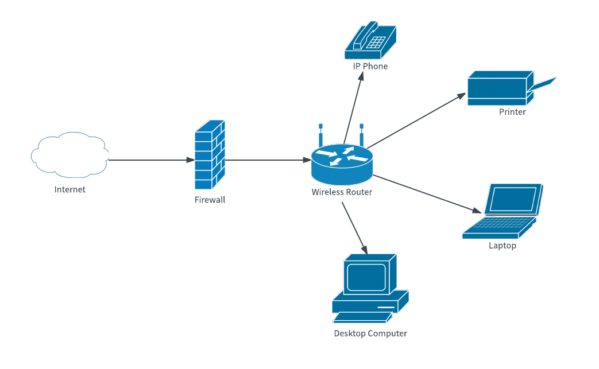
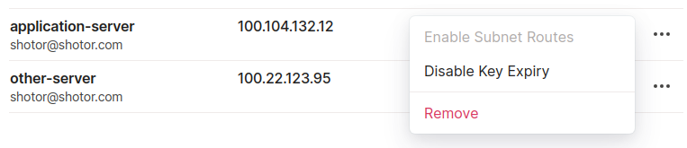
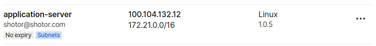
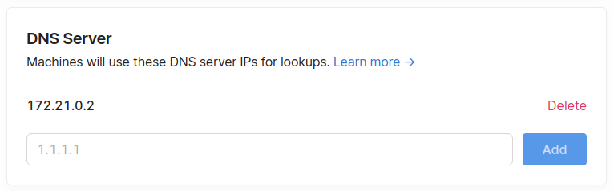

+++
title: "Using PiHole private DNS on a private Tailscale mesh network"
image: images/intro.jpg
+++

I've been using Tailscale for a while to connect all my devices together in a mesh network. I use it to access access web applications running on either of my servers (home or remote), from any of my devices (phone, laptop, tablet). Tailscale makes this real easy. Install it on your devices and it will automatically connect your devices together and assign them unique ip addresses. To see how it works, check out [their blog post ](https://tailscale.com/blog/how-tailscale-works/) that goes in depth.

Recently I wanted to add a [PiHole](https://pi-hole.net/) private DNS server to my setup in order to increase security and privacy while browsing. As well as to use readable hostnames instead of remembering ip addresses or messing with local host file entires.

A simplified view of the setup looks like this:

> TODO: ACTUAL NETWORK DIAGRAM



If you don't want to run your own DNS, but just want readable names for your devices. You can skip this guide and use [Tailscale Magic DNS](https://tailscale.com/kb/1081/magic-dns) instead. It automatically assigns fixed hostnames to all your devices. While it's a really cool feature, with PiHole you get a full fledged DNS server as well as privacy and security features.

## What we're going to do

In this blog post we're going to run PiHole in a docker container on it's own subnet. We'll expose this subnet on our network by turning one of our servers into a Tailscale subnet relay node. Finally we'll set the DNS server to be used by all our Tailscale devices.

## Setting up PiHole

There are a few ways to setup PiHole. In this case I'm running it with Docker on a remote server. But this guide also works if you're hosting PiHole directly. The important part is to have PiHole accessible on the Tailscale mesh network. To do this you can install Tailscale on the server running PiHole, or setup a subnet relay node (see next section).

First I'm going to create a new Docker bridge network, because I don't want to use port bindings to my host machine. This way I can host PiHole on a separate internal IP and use the default port for DNS (53). This keeps the application isolated from the host machine.

```sh
docker network create \
  --driver=bridge \
  --subnet=172.21.0.0/16 \
  --gateway=172.21.0.1 \
  -o "com.docker.network.bridge.name"="docker-apps" \
  -o "com.docker.network.bridge.enable_ip_masquerade"="true" \
  -o "com.docker.network.bridge.enable_icc"="true" \
  -o "com.docker.network.driver.mtu"="1500" \
  apps
```

In my case I also had to allow this network to access the internet by modifying iptables.

```
sudo iptables -t nat -A POSTROUTING -s 172.21.0.0/16 -j MASQUERADE
```

Now we can run a new PiHole docker container on this network. I'm also going to assign it a static IP address. That way we only have to configure it once as our DNS server, and not every time we restart our server and the ip changes.

```sh
docker run -d \
    --name pihole \
    --network=apps \
    --ip=172.21.0.2 \
    -e TZ="Europe/Amsterdam" \
    -v "{{PATH_TO_STORE_PIHOLE_DATA}}/etc-pihole/:/etc/pihole/" \
    -v "{{PATH_TO_STORE_PIHOLE_DATA}}/etc-dnsmasq.d/:/etc/dnsmasq.d/" \
    --dns=127.0.0.1 \
    --dns=1.1.1.1 \
    --restart=unless-stopped \
    --hostname pi.hole \
    -e VIRTUAL_HOST="pi.hole" \
    -e PROXY_LOCATION="pi.hole" \
    -e ServerIP="127.0.0.1" \
    pihole/pihole:latest
```

Now we have a working instance of PiHole running on our server. The only problem is we can only access it on this particular machine, because it uses an internal IP addres. Any other devices on our mesh network can't access this IP, yet.

## Subnet Relay Node

With Tailscale you can expose internal ip addresses of any machine by turning the device into a [relay node](https://tailscale.com/kb/1019/subnets).

We do this by restarting tailscale and instructing it to advertise the subnet we want to expose on the network.

```sh
sudo tailscale up --advertise-routes=172.21.0.0/16
```

If you get errors, make sure IP forwarding is enabled.

```sh
echo 'net.ipv4.ip_forward = 1' | sudo tee -a /etc/sysctl.conf
sudo sysctl -p /etc/sysctl.conf
```

Then for our host machine we disable key expiry and enable subnet routes.



If everything went well you should see the subnet in the admin panel.



You can now access the subnet on any connected device. On Linux devices you'll have to enable this feature first:

```sh
sudo tailscale up --accept-routes
```

Now go to http://172.21.0.2 on any of your devices to see PiHole running. Pretty cool, right?

## Setting the DNS server for all our devices

Exposing subnet routes is already a really powerful feature. You can host applications on internal IP addresses on any of your servers, and access them directly.

But we can take it a step further by using PiHole as the DNS server for all connected devices. Simply put: Turn Tailscale on, and instantly have access to all your self-hosted apps using readable names, as well as the privacy features PiHole provides.

This part is very easy.

In the Tailscale admin console, we're going to click on the DNS tab. And add our PiHole IP address as the DNS server.


That's it. All our devices are now configured to use PiHole as the primary DNS server. You can see this by opening a website on a device and checking the logs in the PiHole UI. Or by checking the contents of the `/etc/resolv.conf` file.

```sh
cat /etc/resolv.conf
# resolv.conf(5) file generated by tailscale
# DO NOT EDIT THIS FILE BY HAND -- CHANGES WILL BE OVERWRITTEN

nameserver 172.21.0.2
```

I'm not going to add a secondary public DNS server like Google or Cloudflare. Because the order in which they are used is not guaranteed. And I want everything to go through PiHole. The next step would be to run another PiHole instance on a different server within the network. This makes the DNS redundant and will avoid connection problems in case one of the nodes goes down.

## Next Steps

Some things to consider doing next:

- Setup readable names for your apps. Click on **Local DNS Records** in the PiHole UI and start mapping your ip addresses. How about pi.hole to access the PiHole UI?
- Add new block lists to block more ads, trackers and malware, [this one](https://hosts.oisd.nl/) is quite popular.
- Run a second instance of PiHole, in case one malfunctions, and add it as the secondary DNS server. [Gravity-sync](https://github.com/vmstan/gravity-sync) can help with synchronization of the PiHole instances.
- Add your home router to the mesh network, so any device connected to your router automatically uses PiHole. Note: you'll probably want a second instance of PiHole instance. In case it goes down. You can ofcourse always log into the Tailscale admin console and change your DNS to a public one if that happens.
- Run some more apps. [Here](https://hub.docker.com/r/linuxserver/calibre) [are](https://hub.docker.com/r/gitea/gitea) [some](https://hub.docker.com/r/linuxserver/syncthing) [cool](https://hub.docker.com/r/linuxserver/code-server) [ones](https://github.com/awesome-selfhosted/awesome-selfhosted).
- Wait a couple of days and see how much traffic PiHole has managed to block. I've been running PiHole for a couple of days and it blocks around 20% of all the DNS requests made.
